## Content

1 EDA

- Sub-Tasks
- Feature: PACKAGE
- Feature: BRAND

2 COCA-COLA

- 2.1 Brand, type and package
- 2.2 Product percent and market share

## 1 EDA

Exploratory Data Analaysis

**Key Interesting Features** :
    - household
    - 1W Rolling Week
    - product type purchased
    - channel

### Sub-Tasks:
- Visual Exploration
- Relationships between features
- Tabular exploration / numeric

### Feature: PACKAGE 

> dataset : the original PHILIPPINES_BEVERAGE_PURCHASE_HHP_CLEANED.csv
>
> Description convention of Distribution:
>
> - `most`: >= larger than 5 times (based on 1000)
> - `1st`, `2nd`, `3rd`: within 10 times 

|      | Package Type             | Distribution                                                 | Sample                                                       |
| ---- | ------------------------ | ------------------------------------------------------------ | ------------------------------------------------------------ |
| 1    | Null                     | 1st: `INSTANT COFFEE`  2nd: `UHT MILK`  3rd: `DRINKING WATER / MINERAL WATER`, `SOFTDRINKS` |                                                              |
| 2    | BAG / POUCH              | only 1 in `POWER SPORTS / ENERGY DRINK`                      |                                                              |
| 3    | BOTTLE                   | only 1 in `POWER SPORTS / ENERGY DRINK`                      |                                                              |
| 4    | BOTTLED WATER            | Only in `DRINKING WATER/MINERAL WATER`                       | 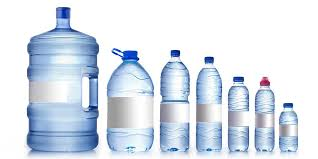 |
| 5    | BOX                      | Most: `INSTANT COFFEE`   Few: `POWER SPROTS / ENERY DRINK` | 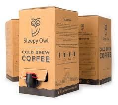                     |
| 6    | BOX (STICK)              | only 98 in `INSTANT COFFEE`                                  | 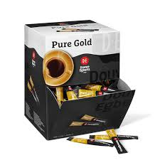         |
| 7    | CAN                      | Most: `LIQUID / RTD JUICE`  2nd: `SOFTDRINKS`  3rd: `UHT MILK` | 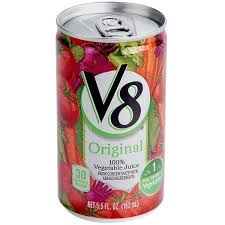                     |
| 8    | DISPENSER                | only in `DRINKING WATER/MINERAL WATER`                       | 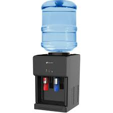         |
| 9    | DOY PACK                 | most: `LIQUID / RTD JUICE`  2nd: `UHT MILK`  3rd: `INSTANT COFFEE` | 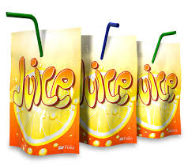           |
| 10   | DOY PACK (RESEALABLE)    | only in `INSTANT COFFEE`                                     | 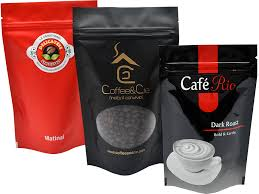 |
| 11   | DOY PACK (W/ TWIST TOP)  | only in `LIQUID / RTD JUICE`                                 |  |
| 12   | FOIL PACK                | only 92 in `LIQUID / RTD JUICE`                              | 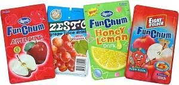       |
| 13   | FOIL PACK (W/ TWIST TOP) | only 5 in `LIQUID / RTD JUICE`                               | 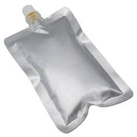 |
| 14   | GLASS BOTTLE             | most: `SOFTDRINKS`  2nd: `LIQUID / RTD SPROTS / ENERGY D` 3rd: `INSTANT COFFEE` 4th: `LIQUID / RTD JUICE` 5th: `UHT MILK` | 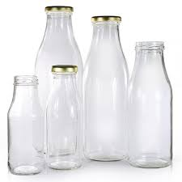 |
| 15   | HARD PAPER               | only 50 in `INSTANT COFFEE`                                  | 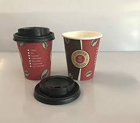     |
| 16   | MASON JAR                | only 16 in `INSTANT COFFEE`                                  | 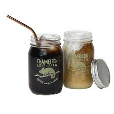       |
| 17   | MUG                      | only 129 in `INSTANT COFFEE`                                 | 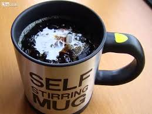                   |
| 18   | PLASTIC BOTTLE           | most: `SOFTDRINKS` 2nd: `LIQUID / RTD SPORTS / ENERGY D` 3rd: `LIQUID / RTD JUICE` 4tht: `INSTANT COFFEE` 5th: `UHT MILK` | 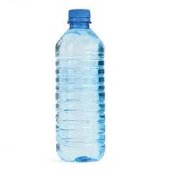 |

|      | Package Type                 | Distribution                                                 | Sample                                                       |
| ---- | ---------------------------- | ------------------------------------------------------------ | ------------------------------------------------------------ |
| 19   | PLASTIC BOTTLE W/ SPORTS CAP | only 17 in `LIQUID / RTD SPORTS / ENERGY D`                  | 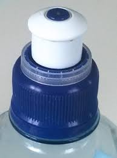 |
| 20   | PLASTIC CELLOPHANE           | only 316 in `INSTANT COFFEE`                                 | 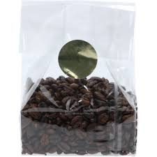 |
| 21   | PLASTIC CUP                  | only in `LIQUID / RTD JUICE`                                 | 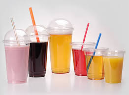   |
| 22   | PLASTIC PACK                 | only in `INSTANT COFFEE`                                     | 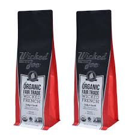 |
| 23   | PLASTIC PACK (REFILL)        | only 14 in `INSTANT COFFEE`                                  |                                                              |
| 24   | PLASTIC PACK (STICK)         | only in `INSTANT COFFEE`                                     | 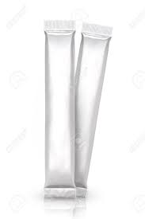 |
| 25   | PLASTIC POUCH                | only 1 in `INSTANT COFFEE`                                   |                                                              |
| 26   | POLY BAG                     | only 1 in `INSTANT COFFEE`                                   |                                                              |
| 27   | REFILL                       | only in `INSTANT COFFEE`                                     |                                                              |
| 28   | SACHET                       | most: `INSTANT COFFEE` 2nd: `POWER SPORTS / ENERGY DRINK` | 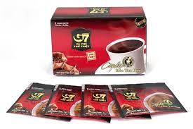             |
| 29   | SACHET (DUO / TWIN PACK)     | only in `INSTANT COFFEE`                                     | 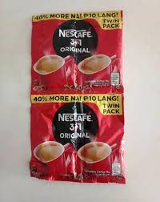 |
| 30   | STICK                        | only in `INSTANT COFFEE`                                     | 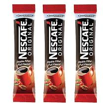               |
| 31   | STYRO CUP                    | only 1 in `INSTANT COFFEE`                                   | 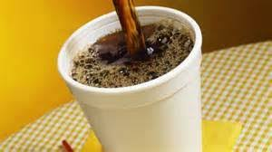       |
| 32   | TETRA PACK                   | most: `UHT MILK` 2nd: `LIQUID / RTD JUICE`                | 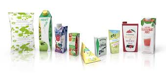     |
| 33   | TETRA PACK (W/ TWIST TOP)    | only in `LIQUID / RTD JUICE`                                 | 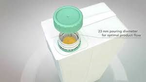 |
| 34   | UTILITY JAR                  | only 9 in `INSTANCT COFFEE`                                  | 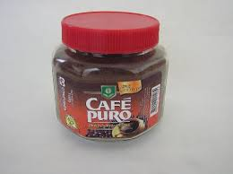   |

### Feature: BRAND

> Top 20 brands with highest purchase records

|      | Brand Name      | Type                           | Manufacturer                           | Description |
| ---- | --------------- | ------------------------------ | -------------------------------------- | ----------- |
| 1    | NESCAFE         | INSTANT COFFEE                 | NESTLE                                 |             |
| 2    | GREATE          | INSTANT COFFEE                 | URC                                    |             |
| 3    | OTHER REFILLING | DRINKING WATER/MINURAL WATER   | OTHER                                  |             |
| 4    | COKE            | SOFTDRINKS                     | COCA-COLA                              |             |
| 5    | KOPIKO BLANCA   | INSTANT COFFEE                 | PT TORABIKA EKA SEMESTA                |             |
| 6    | KOPIKO          | INSTANT COFFEE                 | PT TORABIKA EKA SEMESTA                |             |
| 7    | PEPSI           | SOFTDRINKS                     | PEPSI COLA                             |             |
| 8    | RC COLA         | SOFTDRINKS                     | ASIAWIDE REFRESHMENTS CORPORATION      |             |
| 9    | ROYAL           | SOFTDRINKS                     | COCA-COLA                              |             |
| 10   | SPRITE          | SOFTDRINKS                     | COCA-COLA                              |             |
| 11   | DEL MONTE       | LIQUID / RTD JUICE             | DEL MONTE PHILS                        |             |
| 12   | NESTLE CHUCKIE  | UHT MILK                       | NESTLE                                 |             |
| 13   | MOUNTAIN DEW    | SOFTDRINKS                     | PEPSI COLA                             |             |
| 14   | ZESTO BIG 250   | LIQUID / RTD JUICE             | ZEST-O CORP.                           |             |
| 15   | WILKINGS        | DRINKING WATER/MINERAL WATER   | COCA-COLA                              |             |
| 16   | ZESTO           | LIQUID / RTD JUICE             | ZEST-O CORP.                           |             |
| 17   | WATER MARKET    | DRINKING WATER/MINERAL WATER   | OTHER                                  |             |
| 18   | GATORADE        | LIQUID / RTD SPORTS / ENERGY D | PEPSO-COLA PRODUCTS PHILIPPINES INC.   |             |
| 19   | NATURE' SPRING  | DR                             | PHILIPPINE SPRING WATER RESOURCES INC. |             |
| 20   | NATURE' SPRINT  | DRINKING WATER/MINERAL WATER   | PHILIPPINE SPRING WATER RESOURCES INC. |             |
|      |                 |                                |                                        |             |

## 2 COCA-COLA

> Philippine
>
> dataset : the original PHILIPPINES_BEVERAGE_PURCHASE_HHP_CLEANED.csv

### 2.1 Brand, type and package

> Based on current dataset, COCA-COLA running **13 brands** in Philippine, focusing on `SOFTDRINKS`, `DRINKING WATER/MINUERAL WATER`, `LIQUID / RTD JUICE` 3 products market,  and mainly applied 4 kinds of packages (`GLASS BOTTLE`, `PLASTIC BOTTLE` and `BOTTLED WATER`, `CAN`) for its popular products. 

|      | Brand             | Type                         | Package                                                    |
| ---- | ----------------- | ---------------------------- | ---------------------------------------------------------- |
| 1    | COKE              | SOFTDRINKS                   | most: `GLASS BOTTLE` 2nd: `PLASTIC BOTTLE` 3rd:`CAN` |
| 2    | ROYAL             | SOFTDRINKS                   | 1st: `GLASS BOTTLE` 2nd: `PLASTIC BOTTLE` 3rd: `CAN` |
| 3    | SPRITE            | SOFTDRINKS                   | 1st: `GLASS BOTTLE` 2nd: `PLASTIC BOTTLE` 3rd: `CAN` |
| 4    | WILKINS           | DRINKG WATER/MINERAL WATER   | 1st: `BOTTLED WATER` 2nd: `DISPENSER`                   |
| 5    | MINUTE MAID       | LIQUID / RTD JUICE           | 1st: `TETRA PACK` 2nd: `PLASTIC BOTTLE`              |
| 6    | SPARKLE           | SOFTDRINKS                   | 1st: `GLASS BOTTLE` 2nd: `PLASTIC BOTTLE`               |
| 7    | POP               | SOFTDRINKS                   | 1st: `GLASS BOTTLE` few: `PLASTIC BOTTLE`               |
| 8    | WILKINS PURE      | DRINKING WATER/MINERAL WATER | only `BOTTLED WATER`                                       |
| 9    | SARSI             | SOFTDRINKS                   | 1st: `PLASTIC BOTTLE` 2nd: `CAN`                        |
| 10   | VIVA              | DRINKING WATER/MINERAL WATER | 1st: `BOTTLED WATER` few: `DISPENSER`                   |
| 11   | WILKINS DELIGHT   | DRINKING WATER/MINERAL WATER | only `BOTTLED WATER`                                       |
| 12   | NUTRI JUICE       | LIQUID / RTD JUICE           | only 5 `FOIL PACK`                                         |
| 13   | 8 O'CLOCK FUNCHUM | LIQUID / RTD JUICE           | only 1 `DOY PACK`                                          |

### 2.2 Product percent and market share

